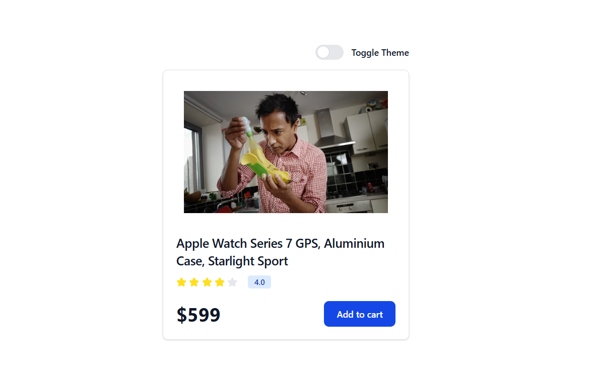
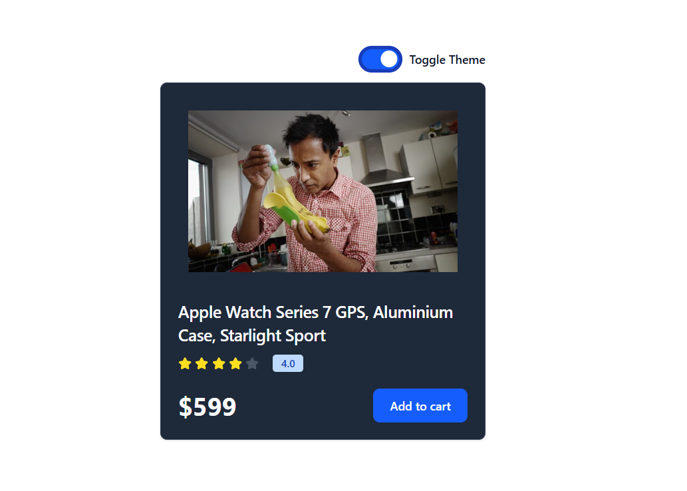

### Another way of creating context

#### Creating context and provider ina single file laong with useContext function (Optional)

```js
import { createContext, useContext } from "react";

export const ThemeContext = createContext({
  themeMode: "light",
  darkTheme: () => { },
  lightTheme: () => { }
})

export const ThemeProvider = ThemeContext.Provider

export default function useTheme() {
  return useContext(ThemeContext)
}
```

### App.jsx

```js
import { ThemeProvider } from './context/theme' 
import ThemeBtn from './components/ThemeBtn';
import Card from './components/Card';

function App() {

  const [themeMode, setThemeMode] = useState("light"); // Local Variable

  // Implementing the functions from the context provider for functionality

  const lightTheme = () => {
    setThemeMode("light")
  }
  const darkTheme = () => {
    setThemeMode("dark")
  }

  // Removing all the themes and inserting our current rquired one
  useEffect(() => {
    document.querySelector('html').classList.remove("light", "dark")
    document.querySelector('html').classList.add(themeMode)
  }, [themeMode])

  return (
    <ThemeProvider value={{ themeMode, darkTheme, lightTheme }}>
      <div className="flex flex-wrap min-h-screen items-center">
        <div className="w-full">
          <div className="w-full max-w-sm mx-auto flex justify-end mb-4">
            <ThemeBtn />
          </div>
          <div className="w-full max-w-sm mx-auto">
            <Card />
          </div>
        </div>
      </div>
    </ThemeProvider>
  )
}

export default App
```
### ThemeBtn.jsx

```js
import React from "react";
import useTheme from "../context/theme";

export default function ThemeBtn() {
// Importing variables from theme.jsx context
  const { themeMode, darkTheme, lightTheme } = useTheme()
// Invoking theme change use checkbox
  const onChangeButton = (e) => {
    const darkModeStatus = e.currentTarget.checked
    if (darkModeStatus) darkTheme()
    else lightTheme()
  }

  return (
    <label className="relative inline-flex items-center cursor-pointer">
      <input
        type="checkbox"
        value=""
        className="sr-only peer"
        onChange={onChangeButton}
        checked={themeMode === "dark"}
      />
      <div className="w-11 h-6 bg-gray-200 peer-focus:outline-none peer-focus:ring-4 peer-focus:ring-blue-300 dark:peer-focus:ring-blue-800 rounded-full peer dark:bg-gray-700 peer-checked:after:translate-x-full peer-checked:after:border-white after:content-[''] after:absolute after:top-0.5 after:left-0.5 after:bg-white after:border-gray-300 after:border after:rounded-full after:h-5 after:w-5 after:transition-all dark:border-gray-600 peer-checked:bg-blue-600"></div>
      <span className="ml-3 text-sm font-medium text-gray-900">Toggle Theme</span>
    </label>
  );
}
```
### Using classes like these to show theme switching effect in Card.jsx

```js
className="w-full bg-white border border-gray-200 rounded-lg shadow dark:bg-gray-800 dark:border-gray-700"
```
### To use dark and light theme in tailwindcss use

```css
@import "tailwindcss";
@custom-variant dark (&:where(.dark, .dark *));
```
### Demo

