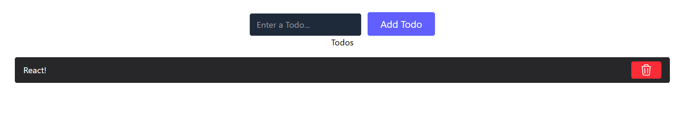

### Why Redux?

Redux is a global state management library used when multiple components need shared data.
`react-redux` connects Redux with React applications.

### `useState` – Local Component State

Used for small, component-level state.
Becomes difficult with shared data and deep prop drilling.

### Flux – Unidirectional Data Flow

Introduced one-way data flow to make state changes predictable.
Flow: `Action → Store → View`.

### Redux – Predictable State Container

Maintains a single source of truth with immutable state updates.
State changes only through actions and pure reducers.

### Redux Toolkit (RTK) – Modern Redux

Official, recommended way to use Redux with less boilerplate.
Provides `configureStore`, `createSlice`, and built-in immutability.

npm install @reduxjs/toolkit
npm install react-redux

dispatch uses reducers to change the value in store

