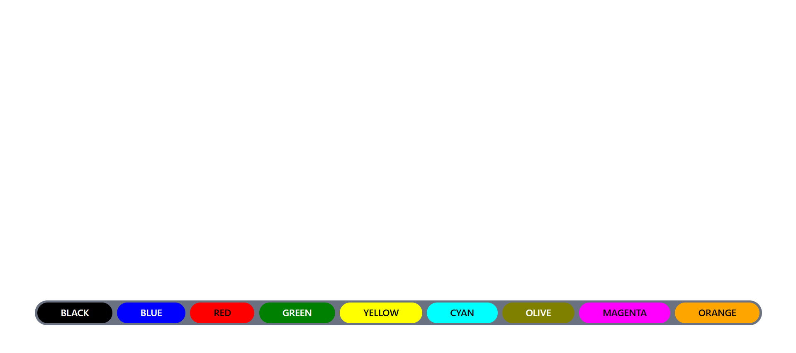
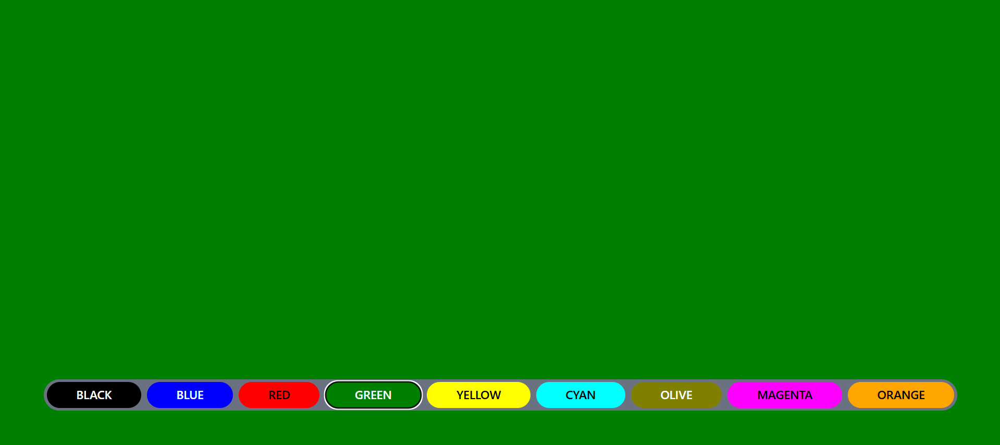

## Just using basic react to create simple bg changing button

### Button Component
```jsx
import React from "react";

function Colors({ color }) {
  let changeBG = () => {
    document.body.style.background = color;
  }

  const textColor = color === "black" || color === "blue" || color === "olive" || color === "green" ? "white" : "black";

  return (
    <button
      style={{ background: color, color: textColor }} className={`h-[35px] rounded-[150px] min-w-[70px] text-center bg-black px-10 m-1`} onClick={changeBG}>{color.toUpperCase()}</button>
  );
}

export default Colors;
```
### Color Bar Component
```jsx
import Colors from "./Colors";

function ColorBar() {
  return (
    <div className="h-auto w-auto rounded-[150px] bg-gray-500 flex flex-wrap justify-around">
      <Colors color='black' />
                :
                :
                :
      <Colors color='orange' />
    </div>
  );
}

export default ColorBar;
```

### Before


### After
