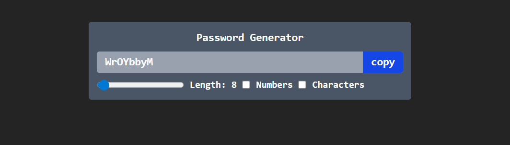

## Theory

### useCallback - It is a React Hook that lets you cache a function definition between re-renders.

```js
const passwordGenerator = useCallback(() => {
  let pass = ""

  let str = "ABCDEFGHIJKLMNOPQRSTUVWXYZabcdefghijklmnopqrstuvwxyz"
  if (numAllowed) str += "0123456789"
  if (charAllowed) str += "~!@#$%^&*_-+=.?"

  for (let i = 1; i <= length; i++) {
    pass += str[Math.floor(Math.random() * str.length)]
  }

  setPassword(pass)
}, [length, numAllowed, charAllowed, setPassword])

const copyToClip = useCallback(() => {
  passwordRef.current?.select()
  window.navigator.clipboard.writeText(password)
}, [password])
```
React Compiler automatically memoizes values and functions, reducing the need for manual userCallback calls.

###### *Memoization is a programming optimization technique that speeds up programs by storing (caching) the results of expensive function calls and returning the cached result when the same inputs occur again*

### useEffect - It is a React Hook that lets you extract non-reactive logic from your Effects into a reusable function called an Effect Event.

```js
useEffect(() => {
  passwordGenerator()
}, [length, numAllowed, charAllowed, passwordGenerator])
```
### useRef - It is a React Hook that lets you reference a value that’s not needed for rendering.

```js
let passwordRef = useRef(null)
// CODE....
<input
  type="text"
  value={password}
  className="outline-none py-1 px-3 flex-1"
  placeholder="Password"
  ref={passwordRef}
  readOnly
/>
```
Here it is used to select the text to indicate that the text is selected


## Demo

