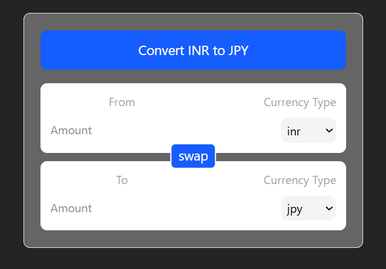
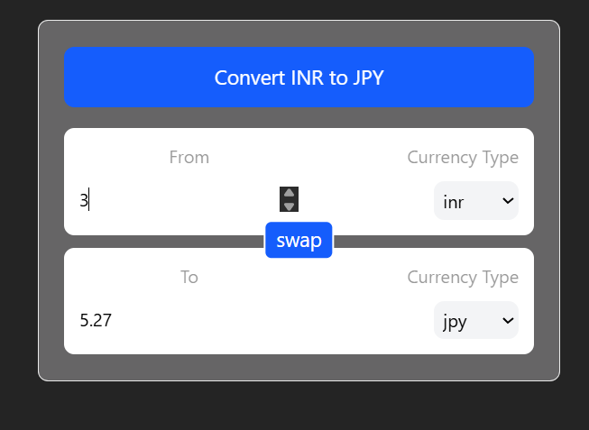

### In Web Frameworks like React, <u>*mounting*</u> is the process of <u>*creating*</u> a component instance and <u>*inserting*</u> it into the Document Object Model (DOM), while <u>*unmounting*</u> (or demounting) is the final phase where the component is <u>*removed*</u> from the DOM and destroyed. 

### Custom Hook

```js
import { useEffect, useState } from "react";

export default function useCurrencyInfo(currency) {
  const [data, setData] = useState({})
  useEffect(() => {
    fetch(`https://cdn.jsdelivr.net/npm/@fawazahmed0/currency-api@latest/v1/currencies/${currency}.json`)
    .then((res) => res.json())
    .then((res) => setData(res[currency]))
  }, [currency])
  return data
}
```
### Importance of key in loops
**In React, the key prop is used to help React efficiently identify and update elements in a list, but you cannot directly access the key value from the event object in an onChange handler. The key is a special attribute used internally by React's reconciliation algorithm.**

```js
<select
  className="rounded-lg px-1 py-1 bg-gray-100 cursor-pointer outline-none"
  value={selectCurrency}
  onChange={(e) => { onCurrencyChange && onCurrencyChange(e.target.value) }}
  disabled={currencyDisable}
>
  {currencyOptions.map((currency) => (
    <option key={currency} value={currency}>
      {currency}
    </option>
  ))}
</select>
```
### Usage of index.js in components for better export readability.

```js
// In index.js inside components folder
export { default as InputBox } from "./InputBox";
export { default as Button } from "./Button";
export { default as Navbar } from "./Navbar";

// In App.js
import { InputBox, Button, Navbar } from "./components";
```
### useId()
**It generates a stable, unique ID string that is, Consistent across server & client (SSR safe) and Unique across the entire React component tree.**
<br>
**Use useId only for accessibility and internal DOM identification — never for data or logic.**

```js
const amountId = useId()

<label htmlFor={amountId} className="text-black/40 mb-2 inline-block">
  {label}
</label>
<input
  id={amountId}
  className="outline-none w-full bg-transparent py-1.5"
  type="number"
  placeholder="Amount"
  value={amount}
  disabled={amountDisable}
  onChange={(e) => { onAmountChange && onAmountChange(Number(e.target.value)) }}
/>
```
### Use of {} in importing

| Export type      | Import syntax                   |
| ---------------- | ------------------------------- |
| `export default` | `import X from './file'`        |
| `export const X` | `import { X } from './file'`    |

#### AND
```js
InputBox.js
└── export default InputBox

index.js
└── export { default as InputBox }

app.js
└── import { InputBox }
```
### Demo

