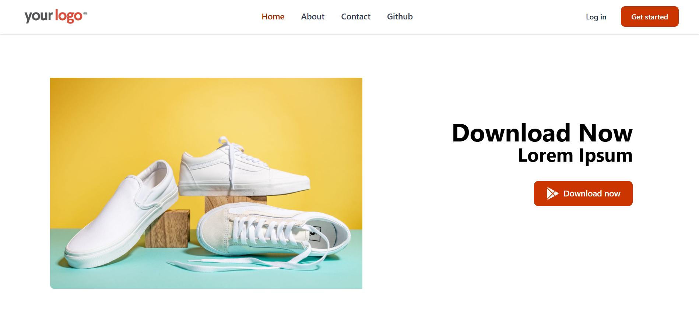
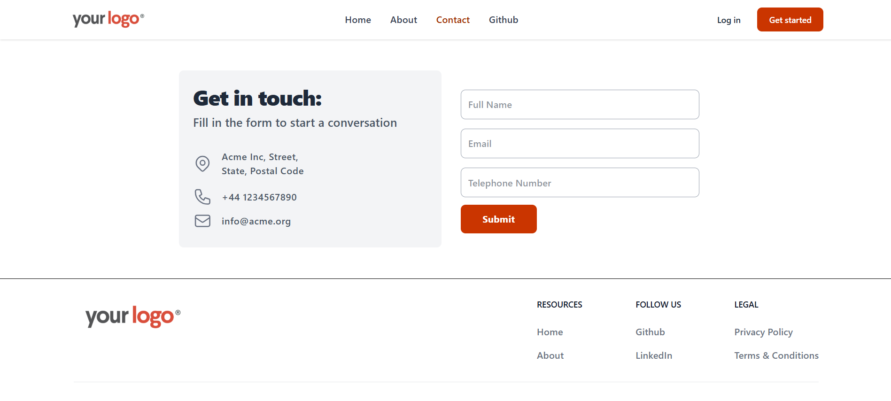
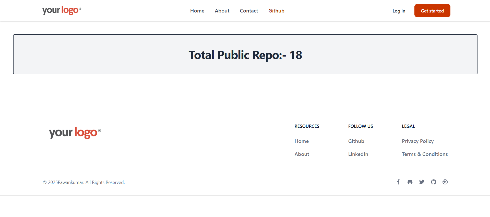

### React Router DOM 
It is a client-side routing library for React that enables navigation between pages without reloading the browser (Single Page Application behavior).

### Installating React Router dom

```js
npm install react-router-dom
```
### Link and NavLink are used in React router for navigation. 

```js
const navItems = [
  { name: 'Home', path: '/' },
  { name: 'About', path: '/about' },
  { name: 'Contact', path: '/contact' },
  { name: 'Github', path: '/github' },
]

const navLinkClass = ({ isActive }) =>
  `block py-2 pr-4 pl-3 duration-200
  ${isActive ? "text-orange-800" : "text-gray-700"}
  border-b border-gray-100 hover:bg-gray-50
  lg:hover:bg-transparent lg:border-0 hover:text-orange-700 lg:p-0`;
```
**We do not use 'a' (anchor tag) because it reloads the whole page.**

### Outlet is used for layouts

```js
import React from "react";
import { Header, Footer } from './components'
import { Outlet } from "react-router-dom";

export default function Layout() {
  return (
    <>
      <Header />
      <Outlet />
      <Footer />
    </>
  )
}
```
### Using RouteProvider by passsing a router Object

```js
createRoot(document.getElementById('root')).render(
  <StrictMode>
    <RouterProvider router={router} />
  </StrictMode>,
)
```
### One way of creating nested router object using createBrowserRouter() method

```js
const router = createBrowserRouter([
  {
    path: '/',
    element: <Layout />,
    children: [
      {
        index: true,
        element: <Home />
      },
      {
        path: 'about',
        element: <About />
      },
      {
        path: 'contact',
        element: <Contact />
      }
    ]
  }
])
```
### Another way and presumably better way to create router object!

```js
const router = createBrowserRouter(
  createRoutesFromElements(
    <Route path='/' element={<Layout />}>
      <Route path='' element={<Home />} />
      <Route path='about' element={<About />} />
      <Route path='contact' element={<Contact />} />
      <Route
        loader={gitInfoFetch}
        path='github'
        element={<Github />}
      />
    </Route>
  )
)
```
### useParams() hook lets you access dynamic URL parameters (like id in /user/:id) inside a component.

```js
import { useParams } from "react-router-dom";

const { userId } = useParams()
return (
  <div className="text-center">User: {userId}</div>
)
```

### Loader (React Router) fetches data before the route renders, while useEffect fetches data after the component renders.

```js
// In github.jsx
export const gitInfoFetch = async () => {
  const response = await fetch('https://api.github.com/users/Pawan4356')
  return response.json()
}

// In main.jsx
<Route
  loader={gitInfoFetch}
  path='github'
  element={<Github />}
/>
```

### Demo:

#### Home


#### About


#### Contact


#### Github
