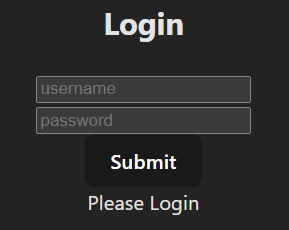
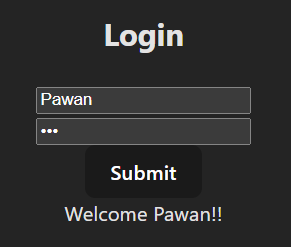

### Requirement for context API 
#### In React applications, state management is required to maintain and share data across components in a predictable way. When data needs to be passed through many nested components, *prop drilling* makes the code complex and hard to maintain. 

#### The Context API solves this by allowing *global data (like theme, user info, or language)* to be accessed by any component without passing props manually.

### useState()

#### React provides useContext() as an inbuilt hook to consume context values directly inside functional components. It simplifies global state access, improves code readability, and reduces unnecessary prop passing. 

#### It is *best suited for low to medium complexity state management*, avoiding the need for external libraries.

### Step 1 - Create context object that holds user data

```js
const UserContext = React.createContext()
export default UserContext;
```
### Step 2 - Create a provider

```js
// Import the Context
import UserContext from "./UserContext";

// Create and Export the conntext provider which provides variables (user) and functions (setUser)
export default const UserContextProvider = ({ children }) => {
  const [user, setUser] = useState();
// Using Context.Provider to store value
  return (
    <UserContext.Provider value={{ user, setUser }}>
      {children}
    </UserContext.Provider>
  )
}
```
### Step 3 - Storing/retreiving the values in/from the context

#### Login.jsx - Stores value

```js
import React, { useState, useContext } from 'react'
import UserContext from '../context/UserContext'

export default function Login() {
  const [userName, setUserName] = useState('')
  const [password, setPassword] = useState('')

  const { setUser } = useContext(UserContext)

  const submit = (e) => {
    e.preventDefault() // Prevents page refresh
    setUser({ userName, password }) // Storing the user info in global context
  }

  return (
    <div>
      <h2>Login</h2>
      <input type='text'
        value={userName}
        onChange={(e) => setUserName(e.target.value)}
        placeholder='username' />
      <br />
      <input type='password'
        value={password}
        onChange={(e) => setPassword(e.target.value)}
        placeholder='password' />
      <br />
      <button onClick={submit}>Submit</button>
    </div>

  )
}
```
#### Profile.jsx - Retreives value

```js
import React, { useContext } from 'react'
import UserContext from '../context/UserContext'

export default function Profile() {

  const { user } = useContext(UserContext)
  
  if (!user) {
    return <div>Please Login</div>
  }
  return (
    <div>Welcome {user.userName}!!</div>
  )
}
```
#### App.jsx - Wraps all the children in the context

```js
import { useState } from 'react'
import './App.css'
import UserContextProvider from './context/UserContextProvider'
import Login from './components/Login'
import Profile from './components/Profile'

function App() {

  return (
    <UserContextProvider>
      <Login />
      <Profile />
    </UserContextProvider>
  )
}

export default App
```
### DEMO

#### Before

#### After
